# rmSeibuCupSoccer_MiSTer

FPGA core for **Seibu Cup Soccer** (Seibu Kaihatsu, 1992) targeting the
[MiSTer FPGA](https://github.com/MiSTer-devel) platform (Terasic DE10-Nano).

Seibu Cup Soccer runs on the Seibu **`legionna.cpp` hardware family** — an
M68000 board with a Seibu CRTC, the SEI252 sprite chip, and the **SEI300 /
COP3 coprocessor**. It shares that board with Legionnaire, Heated Barrel,
Denjin Makai, Godzilla and SD Gundam Sangokushi Rainbow, and it is the **only
one of them that MAME still marks `MACHINE_UNEMULATED_PROTECTION |
MACHINE_NOT_WORKING`**.

This core reimplements the hardware in SystemVerilog from the program ROM,
from MAME references (`legionna.cpp`, `legionna_v.cpp`, `seibu_crtc.cpp`,
`seibucop.cpp`) and from observation on real hardware.

---

# The `rm` version

*This section is the same in every `rm` core: it explains what the line is and
what it adds. Skip it if you already know.*

**`rm` cores are my own builds, published outside the MiSTer-devel tree.** They
are not a fork of the emulation: the core is the same one I contribute
upstream, plus two things the official tree cannot host, because both require
editing the `sys/` framework and MiSTer-devel does not take those changes.

### 1. CRT geometry that leaves HDMI alone

**CRT Adjust** (H-Size, H-Position, V-Shift) and **CRT V-Size** let you align
and size the picture on a 15 kHz tube from the OSD, with the sync left native
so the screen never loses lock, and without duplicating or dropping a single
line.

The point of the whole thing is *where* they sit: **sys-side**, in the analog
chain between the scanline stage and the OSD. The scaler taps the video
**before** that point, so **HDMI stays bit-identical while you adjust the
CRT** — you can align a tube without touching what a capture card or a
streaming setup sees.

V-Size offers two modes: **PVM** (retimes the lines — perfect on broadcast
monitors with a wide lock range) and **Cabinet** (native timing, photometric —
the sync stays rock-steady on arcade chassis with tight AFC).

### 2. Pause overlay

Logo, supporters list and scrolling credits, shown while the game is paused.

### Naming

| | |
|---|---|
| repository / folder | `rm_<Title>_MiSTer` |
| Quartus project and RBF | `rm<Title>` |
| MRA files | `rm <Title> (…).mra` |

The `rm` RBF has a **different file name** from the official core, so the two
can sit on the same SD card without overwriting each other, and you choose
which one to launch from the MRA.

### What the MiSTer-devel version has instead

Everything else, identically: the COP, the audio work, the video fixes,
hardware accuracy. What it does **not** have is the CRT geometry controls and
the pause overlay — the two items above. It keeps a simple analog H/V-Shift
so the picture can still be centred on a tube.

---

## About the game

**Seibu Cup Soccer** is an arcade football game with a top-down angled view and
short, fast matches. Up to four players can join in, and the cabinet keeps the
match going as long as credits are added. It was also released as *Olympic
Soccer '92* and in a *Selection* revision.

## Status

**Current version: 1.0.**

The core boots, plays and has been checked against the original PCB. All six
playable sets are provided as MRAs. Video, audio, four-player inputs, DIP
switches and the coprocessor are implemented.

---

# The COP: how a game MAME calls "unemulated protection" was solved

This is the part of the core that took the work, and it is worth telling,
because almost none of it could be copied from anywhere.

## The starting point: there is no oracle

The SEI300 ("COP3") is a coprocessor the game leans on for **everything that
matters**: where a player runs, where the ball lands, who reaches it first,
collisions with posts and other players, headers, volleys, the radar dots,
the depth ordering of the twenty-two players on screen.

MAME marks Seibu Cup Soccer as unemulated protection, and the code that is
there is partly guesswork — several of its comments turned out to be **wrong**,
not merely incomplete. So the working rule for this core, set on day one, was
a hierarchy:

> **ROM > behaviour in game > MAME.**

The program ROM cannot lie. The game's own code, disassembled, says what it
expects from the chip. MAME is a hint, and a good one, but never the last word.

## The key that unlocked it: the ROM decides, not the game name

The chip is programmed at boot: the 68000 uploads a table of **microcode
sequences** into the COP, and every command the game later triggers is matched
against that table. MAME dispatches many of these commands by game name.

The table in the ROM, at `$00B720`, says which variant the chip is actually
running. That turned out to be the single most useful fact in the whole
project, and it settled several disputes on its own:

- **Command `6200`** exists twice in MAME (`execute_6200` and
  `LEGACY_execute_6200`) with different registers and offsets. The ROM's
  microcode sequence — `3a0 3a6 380 aa0 2a6` — selects the **LEGACY** one,
  reading from `cop_regs[1]+0x0C` and not `cop_regs[0]+0x34`. The core had
  inherited the wrong one from the family, which is why players froze at
  kick-off. A dedicated testbench scored **256/256** with the fix and **0/256**
  with the previous code regenerated.
- **The atan family** (`118e`, `130e`, `138e`, `330e`, `338e`, `e18e`, `e30e`,
  `e38e`) is selected the same way; Seibu Cup uses a variant that writes the
  angle **raw**, without the `^0x80` of Legionnaire.
- **Who writes the resulting angle** is decided by the **length field** of the
  trigger, not by bit 7 as MAME has it: commands of length 8 write it, those of
  length 4 do not. That one fixed the "moonwalk" — players moving correctly
  while facing the wrong way — without any hardware to test against: frame
  step 3 wrote the angle, step 5 overwrote it with twenty-two length-4
  commands, step 6 read the corrupted value.

## Measuring instead of guessing

Two habits saved more time than any single discovery.

**A probe on the real thing.** A LUA tap on the COP window running under MAME
showed which commands the game *actually* issues during a match. Result:
`f105` fires thousands of times, while `5105` and `5905` — two commands that
had already cost two 24-minute FPGA builds — **are never invoked at all**. The
defect being chased was semantic, not RTL, and it was cheaper to find in
seconds on a probe than in an hour of compiles.

That probe had itself been lying for a while: MAME's `install_read_tap`
returns an object whose destructor removes the tap, so a script that does not
keep the return value has its probe silently garbage-collected. Every LUA
measurement taken before that was found in the MAME source is untrustworthy —
which explained a long run of inconsistent results.

**Ask the ROM.** The angle convention was settled not by trying values but by
reading the joystick table at `$01DBD4`: fourteen bytes that map right to
`$00`, down to `$40`, left to `$80`, up to `$C0`, with the diagonals at a
3:4 ratio — the perspective compression is baked into the table. The same
reading proved that `obj+$04` is **Y** and `obj+$08` is **X**, the opposite of
what had been assumed.

## The bootleg had the answers

Late in the project it turned out that the romset already contained the thing
everyone assumed was lost: the bootleg board replaces the COP with discrete
logic, and to do that it carries **the chip's lookup tables in two 512 KB
ROMs** — a megabyte of ground truth sitting in the same zip.

Read out and compared against the core's generated tables:

| table | result |
|---|---|
| sine | **0 discrepancies** over 65536 cells |
| cosine | **0 discrepancies** over 65536 cells |
| division, scale 0 | **0 discrepancies** over 65536 cells |
| division, scale 5 | **0 discrepancies** over 65536 cells |
| hypotenuse + atan | 261922 of 262144 cells; the 222 that differ are all and only those with bit `0x4000` clear |

And it answered a question MAME had given up on. `seibucop.cpp` says *"atan
maths are nowhere to be found from the roms"*. They are: the arctangent is
**packed into the low 6 bits of the hypotenuse table**, one word holding both
results for the same operand pair —

```
word[(A << 9) | B] = floor(hypot(A,B)) << 6 | floor(atan2(B,A) * 63 / (pi/2))
```

— which also settled that the division **truncates** rather than rounding
(MAME's comment says otherwise, and is right only 52% of the time), and that
the amplitude doubling at the cardinal angles is done **by the hardware**, not
by the caller.

## Things MAME says that are not true

Collected along the way, each disproved from the ROM or from the tables:

- *"f105 controls player vs. ball"* — none of its 35 call sites is in the
  contact code.
- *"d104 controls player vs. player collision"* — it projects the ball into
  the zone a player is responsible for. The give-away was in the zone table:
  the two constants read as addresses are `65536/480` and `65536/1184`, i.e.
  the **field dimensions** in fixed point.
- *"atan maths are nowhere to be found"* — see above.
- The correct version of command `3bb0` was already **in** MAME, but buried
  inside an `#ifdef UNUSED_COMMANDS` that is never defined.
- The depth sort looked implemented and was **inert**: the sort key was being
  read from an address the game never writes, so every key was zero. It
  "worked" because it did nothing.

## What it cost, and what it gave

Thirty COP commands are implemented — the most complete of the family, against
sixteen for Godzilla or Rainbow. The sort-DMA alone needed three separate
corrections to work: the game passes the entry count **minus one**, the key
must be read as a **word**, and it must be read **signed** (a player already on
the ball has key `$FFFF`). Without the ordering, the game kept testing entries
0 and 1 — the goalkeeper.

The verdict came on **6 August 2026** from someone who owns the original PCB
and had never seen the core:

> *"it feels like playing the original PCB; collisions with the posts and with
> other players, rebounds, headers, super shots, volleys — it is all exactly
> in line with the PCB."*

Every single one of those things goes through the coprocessor.

### The board itself

The PCB these findings were checked against — a SYS68C2, 1992.

| | |
|---|---|
| 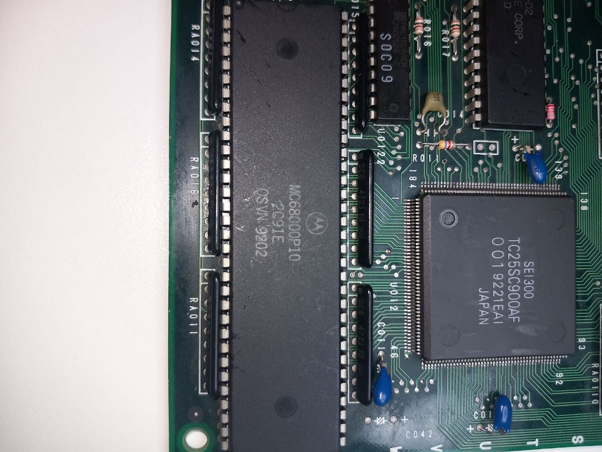 | 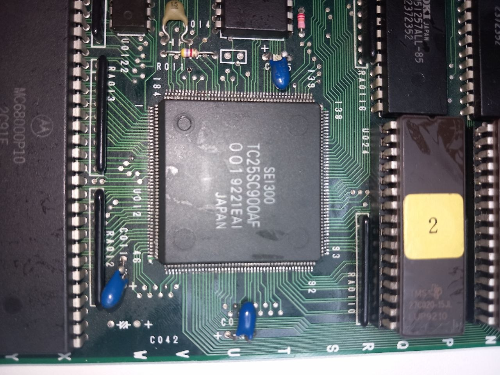 |
| The MC68000P10 and, to its right, the coprocessor | `SEI300 TC25SC900AF`, date code 9221 — the chip this core had to work out |

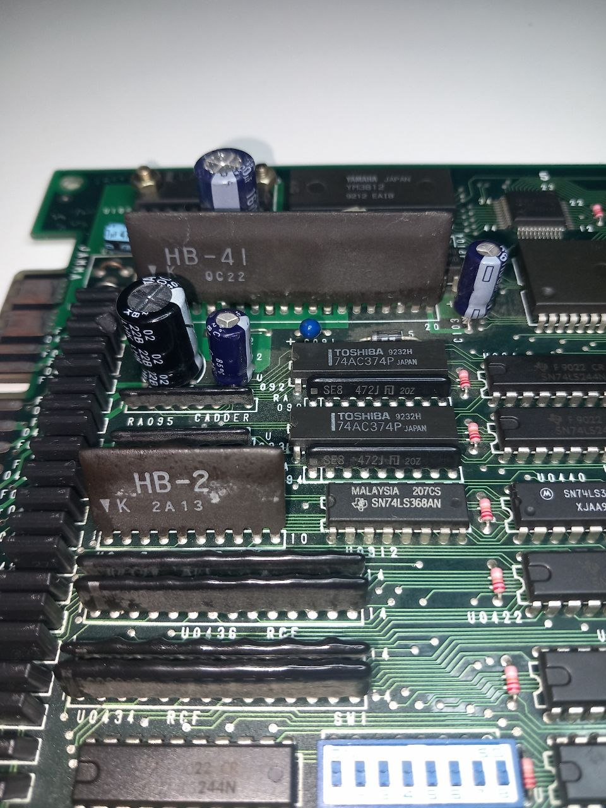

*The audio side: Yamaha YM3812 (OPL2), the HB-41 / HB-2 modules and the DIP banks.*


---

## What else is in the core

**Video.** 320×240 active, `H_TOTAL` 436, `V_TOTAL` 262 → 60.03 Hz; pixel clock
96/14 = 6.857 MHz, line rate 15.727 kHz. Seibu CRTC with BG / MG / FG tilemaps
and the text layer, SEI252 sprite renderer with 4-level priority.

**Audio.** YM3812 (OPL2) and OKI M6295 ADPCM. The drums were missing until the
OPL2 core was found to be missing **five upstream rhythm fixes** — accumulator
slot mask, feedback shift, pipeline offsets for hi-hat and top cymbal, decay
rate — all on the rhythm channel. With those transplanted, plus the 4× FIR
upsampler on the OKI and a soft-clip mixer, the percussion is there. Per-channel
volume for all nine FM channels and four OKI channels is exposed in the OSD.

**Timing.** The core closes with every clock positive and zero total negative
slack. It did not start that way: it went from **−2.522 ns** to positive over
ten rounds of re-pipelining, each one proven equivalent on a testbench
*before* compiling — two equivalence benches were written for the purpose, one
for the COP and one for the sprite renderer, each comparing the current logic
against a frozen copy of itself over millions of cycles.

**CRT.** See the `rm` section at the top. The V-Size stage was measured against
the game's real raster, not a synthetic one, which is how two line-loss defects
were found and fixed: the vertical window is now taken from the line buffer's
own content instead of the caller's blanking signal, and the negative V-Shift
wraps on the **measured** frame length rather than a compile-time constant — it
used to jump by `1 + vsize` lines on the first negative step whenever V-Size
was active.

## Sets provided

Six MRAs, all from the same merged `cupsoc.zip`. The parent sits in
[releases/](releases/); the other five are in
`releases/_alternatives/_rm Seibu Cup Soccer/`, which is the layout the MiSTer
arcade menu expects.

| MRA | MAME set | |
|---|---|---|
| `rm Seibu Cup Soccer (set 1).mra` | `cupsoc` | parent |
| `rm Seibu Cup Soccer (set 2).mra` | `cupsoca` | alternative |
| `rm Seibu Cup Soccer (set 3).mra` | `cupsocb` | alternative |
| `rm Olympic Soccer '92 (set 1).mra` | `olysoc92` | alternative |
| `rm Olympic Soccer '92 (set 2).mra` | `olysoc92a` | alternative |
| `rm Olympic Soccer '92 (set 3).mra` | `olysoc92b` | alternative |

The two *Selection* sets (`cupsocs`, `cupsocs2`) are not included: they use a
different CRTC memory map and need RTL work, not just an MRA.

## Known issues

- The **sprite priority masks** are inherited from MAME, where two of the four
  values carry the authors' own question marks (`legionna_v.cpp` gives cupsoc
  `0xfff0`, `0xfffc "?"`, `0xfffe "?"`, `0x0000`, rotated by one position
  relative to Legionnaire). The core reproduces that uncertainty rather than
  the hardware. They should be derived from the data.

## Screenshots

| | |
|---|---|
|  | 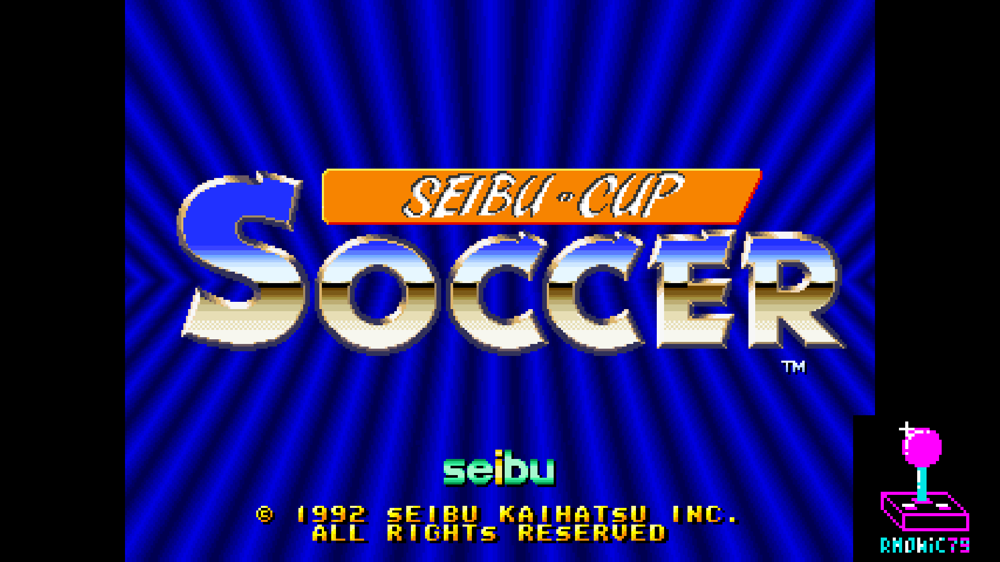 |
| Seibu Kaihatsu | Title |
| 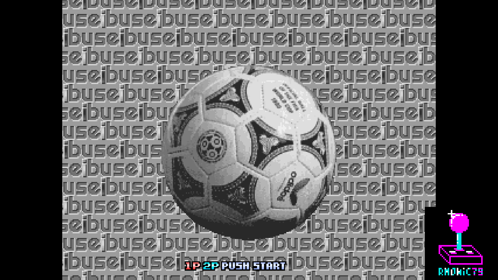 | 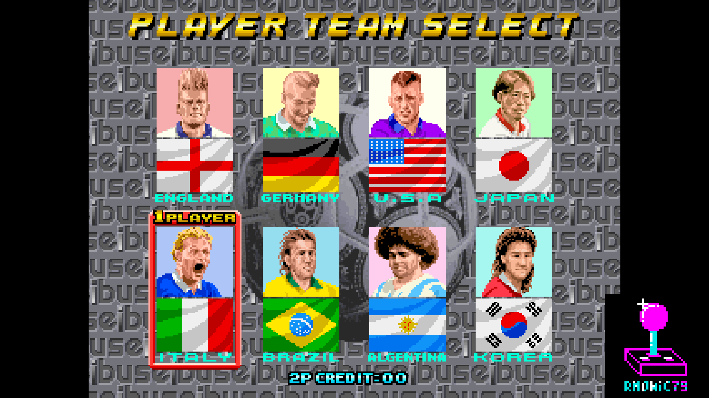 |
| Push start | Team select |
| 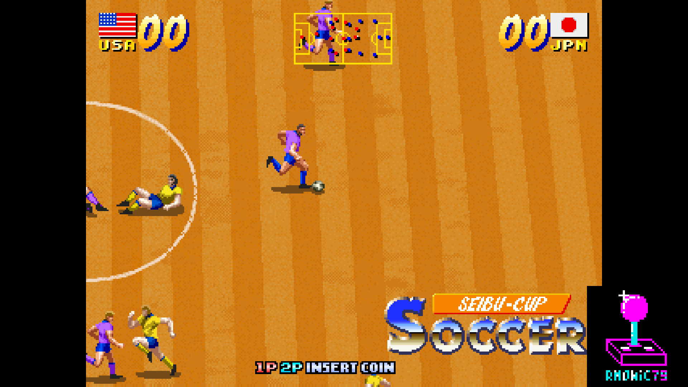 | 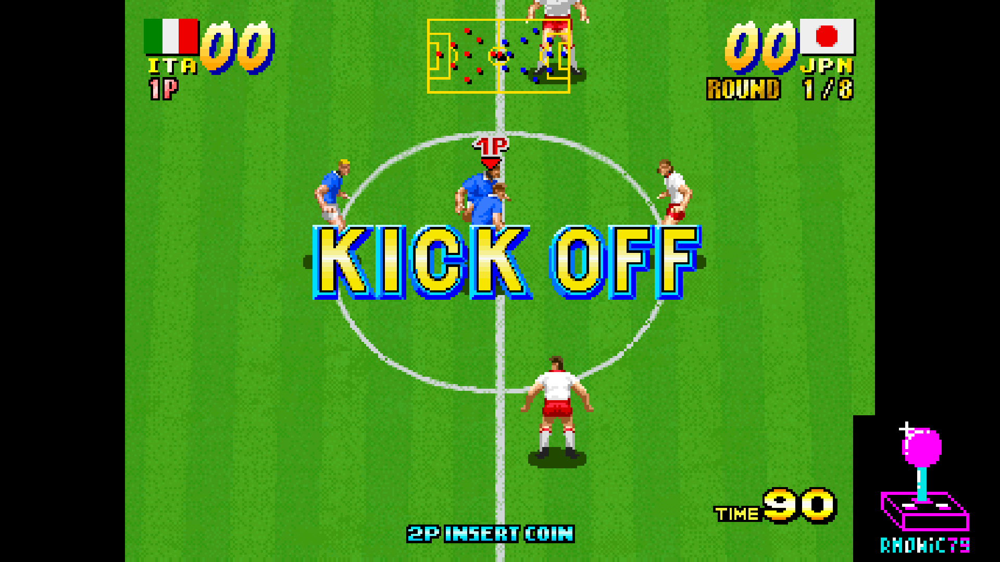 |
| Attract mode | Kick-off |
| 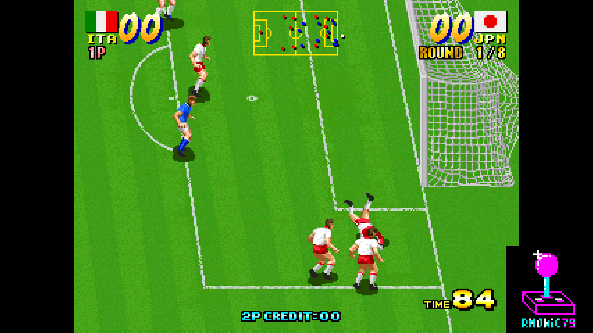 | 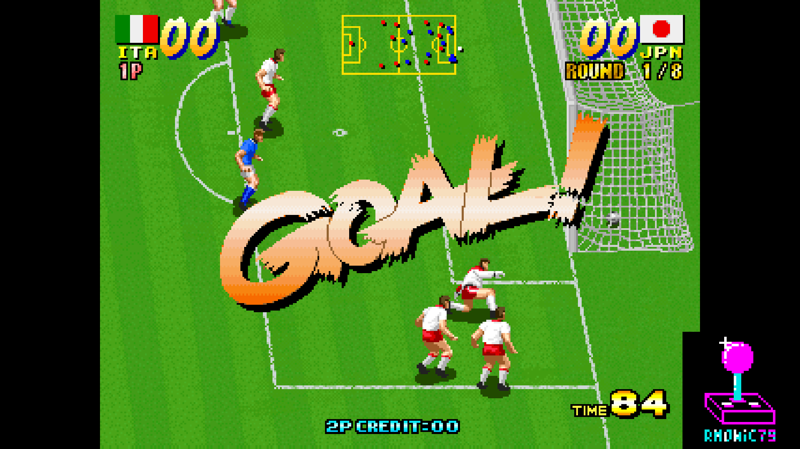 |
| Match | Match |
| 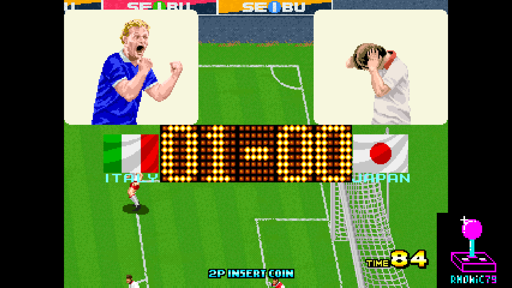 | |
| Match | |

## Hardware emulated

| Component        | Spec                                                |
|------------------|-----------------------------------------------------|
| Main CPU         | M68000 @ 10 MHz (FX68K, cycle-accurate)             |
| Sound CPU        | Zilog Z80 @ 3.579545 MHz (T80)                      |
| Sound chip 1     | Yamaha YM3812 OPL2 (jtopl2)                         |
| Sound chip 2     | OKI M6295 ADPCM (jt6295)                            |
| Video            | Seibu CRTC — BG / MG / FG tilemaps + text layer     |
| Sprites          | Seibu SEI252, 16×16 4bpp, 4-level priority          |
| Coprocessor      | Seibu SEI300 / COP3 — 30 commands                   |
| Palette          | xBGR_555, 2048 entries                              |

## Hardware requirements

- Terasic DE10-Nano
- MiSTer I/O board (recommended)
- SDRAM module
- Works on HDMI displays and on CRTs via the analog video output

## Building from source

Requires Quartus Prime 17.0 (free Lite Edition).

```
Open rmSeibuCupSoccer.qpf in Quartus → Processing → Start Compilation
```

Output bitstream is generated in `output_files/rmSeibuCupSoccer.rbf`.

## Running on MiSTer

The [releases/](releases/) folder contains the MRAs and a prebuilt bitstream.

1. Copy `rmSeibuCupSoccer_YYYYMMDD.rbf` to `_Arcade/cores/` on the MiSTer SD card, named
   `rmSeibuCupSoccer.rbf` — that is the name the MRAs look for. The
   MiSTer-devel core keeps its own name, so both can sit there together.
2. Copy `releases/rm Seibu Cup Soccer (set 1).mra` to `_Arcade/`, and the
   `_alternatives/` folder alongside it if you want the other five sets.
3. Provide your legally-owned `cupsoc.zip` where the MRA expects it
   (usually in `games/mame/`).

**ROMs are NOT included in this repository.** You must provide them yourself.

## Repository layout

```
rmSeibuCupSoccer_MiSTer/
├── rtl/
│   ├── SeibuCup/        core RTL (buses, CRTC, tilemaps, sprites, COP3, audio glue)
│   ├── jtframe/         JTFRAME framework modules
│   ├── sound/           jtopl2 (YM3812), jt6295 (OKI M6295), t80 (Z80), mixer
│   ├── fx68k/           Motorola 68000 CPU core
│   └── pll/             Clock PLL
├── sys/                 MiSTer framework + CRT Adjust / V-Size (sys-side)
├── logo/                Pause overlay assets (font, logo, supporter list)
├── tools/               lint, simulation and equivalence testbenches
├── docs/                in-game screenshots
├── releases/            MRA files (+ _alternatives/ for the other sets)
├── rmSeibuCupSoccer.qpf Quartus project
├── rmSeibuCupSoccer.qsf Quartus assignments
├── SeibuCup.sv          Top-level core wrapper
├── Template.sdc         Timing constraints
├── files.qip            HDL file list
├── build_id.v           Build version stamp
└── README.md            This file
```

## Acknowledgements

- **Jorge Cwik** ([ijor](https://github.com/ijor)) for the **FX68K**
  cycle-accurate Motorola 68000 core.
- **Jose Tejada** ([@jotego](https://github.com/jotego)) for JTOPL2
  (YM3812), JT6295 (OKI M6295) and the JTFRAME framework.
- **Daniel Wallner** for the **T80** Z80 CPU core.
- **Andrea Bogazzi** ([@asturur](https://github.com/asturur)) for the work
  on the CRT adjust module.
- The **MAMEDev team** for the reference on the Seibu `legionna` hardware,
  memory maps, the CRTC and the COP — including the parts this core had to
  disagree with, which were still the starting point for finding the right
  ones.
- The owner of the original PCB who tested the coprocessor work and gave the
  verdict quoted above.
- **Sorgelig** and the **MiSTer-devel team** for the framework, SDRAM
  controller and Template.

## Support this project

If you enjoy this core and want to support its development:

- [Ko-fi](https://ko-fi.com/ibecerivideoludici) — one-time support
- [Patreon](https://www.patreon.com/IBeceriVideoludici) — monthly support
- [PayPal](https://www.paypal.me/IBeceriVideoludici) — one-time donation

## Follow

- [GitHub](https://github.com/rmonic79)
- [Twitch](https://twitch.tv/ibecerivideoludici) — live streams
- [YouTube](https://www.youtube.com/c/IBeceriVideoludici) — playlists and videos
- [X / Twitter](https://x.com/rmonic79)

## License

The RTL source code in this repository is provided as-is for educational
and preservation purposes under **GNU GPL v3 or later**. Original ROM data
is not included; users must provide their own legally obtained copies.

Original *Seibu Cup Soccer* arcade game © Seibu Kaihatsu, 1992.
